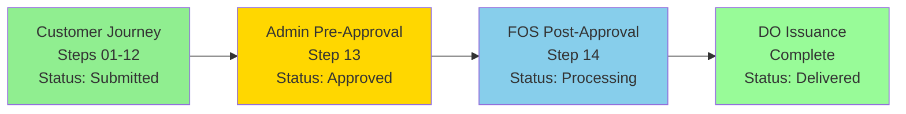
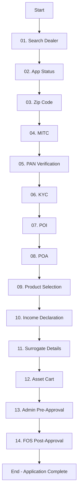

# 📋 SFDC POS Automation - Master Test Scenarios Document

**Version:** 3.0.0  
**Last Updated:** August 26, 2026  
**Framework:** TypeScript + Playwright  
**Total Test Cases:** 112+  
**Test Files:** 19
**Modules:** 15 (Customer Onboarding Journey)

---

## 📑 Table of Contents

1. [Overview](#overview)
2. [Test Execution Sequence - What Happens When You Run Tests](#test-execution-sequence)
3. [Complete Execution Order](#complete-execution-order)
4. [Handling Pre-Approval & Post-Approval Scenarios](#handling-pre-approval-post-approval)
5. [Handling Existing Customer Scenarios](#handling-existing-customers)
6. [Test Data Flow Between Tests](#test-data-flow)
7. [Test Execution Flow](#test-execution-flow)
8. [Customer Journey Tests (01-12)](#customer-journey-tests)
9. [Admin Approval Tests (13)](#admin-approval-tests)
10. [FOS Post-Approval Tests (14)](#fos-post-approval-tests)
11. [End-to-End Tests](#end-to-end-tests)
12. [Test Data Management](#test-data-management)
13. [Running Tests](#running-tests)
14. [Test Metrics](#test-metrics)

---

## 🎯 Overview

### Purpose
This document provides a comprehensive overview of all test scenarios in the SFDC POS Automation Framework. It serves as a single source of truth for understanding test coverage, execution flow, and scenario details.

### Test Architecture
```
SFDC POS Automation
│
├── Customer Onboarding Journey (15 Modules)
│   ├── 01. Search Dealer
│   ├── 02. App Status
│   ├── 03. Zip Code Verification
│   ├── 04. MITC (Most Important Terms & Conditions)
│   ├── 05. PAN Verification
│   ├── 06. Product Selection
│   ├── 07. Income Declaration
│   ├── 08. KYC (E-KYC)
│   ├── 09. POI (Proof of Identity)
│   ├── 10. POA (Proof of Address)
│   ├── 11. Surrogate Details
│   ├── 12. Approval Details
│   ├── 13. Additional Details
│   ├── 14. Reappraisal
│   └── 15. Asset Cart (Proceed to DO)
│
└── E2E Flows (3 Complete Flows)
    ├── Customer Journey E2E
    ├── Admin Approval E2E
    └── Post-Approval E2E
```

---

## � Test Execution Sequence - What Happens When You Run Tests

### **When You Execute: `npx playwright test`**

Here's the complete step-by-step execution sequence:

```
┌─────────────────────────────────────────────────────────────┐
│              PLAYWRIGHT TEST EXECUTION FLOW                  │
└─────────────────────────────────────────────────────────────┘

STEP 1: LOAD CONFIGURATION (playwright.config.ts)
═══════════════════════════════════════════════════════
├─→ Read test directory: ./tests
├─→ Load timeout settings: 5 minutes per test
├─→ Load workers: 1 (sequential execution)
├─→ Load reporters: HTML, JSON, List
├─→ Load browser config: Chromium (Desktop Chrome)
└─→ Load global settings: screenshots, videos, traces

STEP 2: DISCOVER TEST FILES (Alphabetical Order)
═══════════════════════════════════════════════════════
├─→ Scan ./tests folder recursively
├─→ Find all *.spec.ts files
├─→ Sort files alphabetically:
│   
│   📁 tests/admin/
│   ├─→ 13_preApproval.spec.ts .................. [1st] ⚠️
│   
│   📁 tests/customer/
│   ├─→ 01_searchDealer.spec.ts ................ [2nd]
│   ├─→ 02_appStatus.spec.ts ................... [3rd]
│   ├─→ 03_zipCode.spec.ts ..................... [4th]
│   ├─→ 04_mitc.spec.ts ........................ [5th]
│   ├─→ 05_panVerification.spec.ts ............. [6th]
│   ├─→ 06_kyc.spec.ts ......................... [7th]
│   ├─→ 07_poi.spec.ts ......................... [8th]
│   ├─→ 08_poa.spec.ts ......................... [9th]
│   ├─→ 09_productSelection.spec.ts ............ [10th]
│   ├─→ 10_incomeDeclaration.spec.ts ........... [11th]
│   ├─→ 11_surrogateDetails.spec.ts ............ [12th]
│   └─→ 12_assetCart.spec.ts ................... [13th]
│   
│   📁 tests/e2e/
│   ├─→ admin-approval.spec.ts ................. [14th]
│   ├─→ customer-journey.spec.ts ............... [15th]
│   └─→ post-approval.spec.ts .................. [16th]
│   
│   📁 tests/fos/
│   └─→ 14_postApproval.spec.ts ................ [17th]
│
└─→ Total: 17 test files discovered

STEP 3: INITIALIZE FIXTURES (fixtures/base.fixture.ts)
═══════════════════════════════════════════════════════
├─→ Create Page Object instances:
│   ├─→ LoginPage (common authentication)
│   ├─→ DealerSearchPage (dealer search functionality)
│   ├─→ AppStatusPage (application status)
│   ├─→ ZipCodePage (zip code verification)
│   ├─→ MitcPage (customer name & terms)
│   ├─→ KycPage (E-KYC verification)
│   ├─→ PoiPage (proof of identity)
│   ├─→ PoaPage (proof of address)
│   ├─→ ProductSelectionPage (product catalog)
│   ├─→ IncomeDeclarationPage (income details)
│   ├─→ SurrogateDetailsPage (surrogate documents)
│   ├─→ AssetCartPage (application submission)
│   └─→ AdminCustomerPage (admin approval)
│
└─→ Inject page objects into test context via Playwright fixtures

STEP 4: EXECUTE EACH TEST FILE (Sequential - workers: 1)
═══════════════════════════════════════════════════════

   ┌───────────────────────────────────────────────────┐
   │    FILE 1: tests/admin/13_preApproval.spec.ts     │
   └───────────────────────────────────────────────────┘
   
   A. RUN test.beforeAll() - ONCE per test file
      ├─→ Initialize ExcelReader instance
      ├─→ Load test data: getTestDataForTestCase('TC_13_PreApproval')
      ├─→ Load Deal ID (from Excel or previous test state)
      └─→ Console log: "✓ Test Data Loaded: X fields"
   
   B. FOR EACH TEST CASE in file:
      
      Test Case 1: "Positive: Admin search and approve by Deal ID"
      ───────────────────────────────────────────────────────────
      
      i. RUN test.beforeEach()
         ├─→ Create new browser context (fresh session)
         ├─→ Create new page instance
         ├─→ Initialize all page objects with current page
         ├─→ Execute: loginPage.loginToAdmin(...)
         │   ├─→ Navigate to admin URL
         │   ├─→ Enter username and password
         │   ├─→ Click login button
         │   └─→ Wait for dashboard to load
         └─→ Ready for test execution
      
      ii. RUN TEST BODY with test.step()
            
          Step 1: "Login to Admin"
          ├─→ Execute: loginPage.loginToAdmin(url, user, pass, button)
          ├─→ Wait for navigation
          └─→ Verify admin dashboard visible
          
          Step 2: "Search by Deal ID"
          ├─→ Execute: adminCustomerPage.searchByDealId(dealId)
          ├─→ Wait for search results
          └─→ Verify customer record found
          
          Step 3: "Open Customer Record"
          ├─→ Execute: adminCustomerPage.openCustomerRecord(dealId)
          ├─→ Wait for details page to load
          └─→ Verify customer information displayed
          
          Step 4: "Approve Application"
          ├─→ Execute: adminCustomerPage.approveApplication()
          ├─→ Wait for approval confirmation
          └─→ Console log: "✓ Application approved"
      
      iii. RUN ASSERTIONS (expect statements)
           ├─→ expect(page.locator('text=Approved')).toBeVisible()
           ├─→ expect(successMessage).toContain('approved')
           └─→ All assertions pass ✅
      
      iv. RUN test.afterEach() (if defined)
          ├─→ Take screenshot if test failed
          ├─→ Record video if test failed  
          ├─→ Save trace if test failed
          └─→ Close browser context (cleanup)
      
      v. CAPTURE RESULTS
         ├─→ Test Status: PASSED ✅
         ├─→ Duration: 45 seconds
         ├─→ Screenshots: 0 (only on failure)
         └─→ Update test report
      
      [Repeat i-v for remaining test cases in file]
   
   C. RUN test.afterAll() - ONCE after all tests
      └─→ Final cleanup for test suite (if defined)

   ┌───────────────────────────────────────────────────┐
   │    FILE 2: tests/customer/01_searchDealer.spec.ts │
   └───────────────────────────────────────────────────┘
   
   [Repeat A → B → C sequence with different test cases]
   
   ┌───────────────────────────────────────────────────┐
   │    FILE 3-17: Remaining test files...             │
   └───────────────────────────────────────────────────┘
   
   [Continue execution for all 17 test files]

STEP 5: GENERATE REPORTS
═══════════════════════════════════════════════════════
├─→ HTML Report: reports/html/index.html
│   ├─→ Test summary (passed, failed, skipped)
│   ├─→ Individual test results with details
│   ├─→ Screenshots for failed tests
│   ├─→ Execution timeline
│   └─→ Browser console logs
│
├─→ JSON Report: reports/test-results.json
│   └─→ Machine-readable test results
│
└─→ Console Output (List Reporter)
    ├─→ Test execution progress
    ├─→ Pass/fail status for each test
    └─→ Final summary with statistics

STEP 6: EXIT
═══════════════════════════════════════════════════════
├─→ Calculate exit code:
│   ├─→ 0 = All tests passed ✅
│   └─→ 1 = One or more tests failed ❌
│
└─→ Exit process with code
```

### **Key Points About Execution:**

1. **Sequential Execution:** With `workers: 1`, tests run one after another, not in parallel
2. **Fresh Context:** Each test gets a new browser context (isolated cookies, storage, etc.)
3. **Alphabetical Order:** Tests execute in alphabetical order by file path (⚠️ can cause issues)
4. **Fixture Lifecycle:** Page objects are created fresh for each test via beforeEach
5. **Error Handling:** If a test fails, remaining tests continue (unless --max-failures set)

---

## ⚠️ Complete Execution Order

### **Current Default Order (Alphabetical - Has Issues!)**

```
DEFAULT EXECUTION ORDER (Alphabetical by File Path):
═══════════════════════════════════════════════════════════

Position | File Path                              | Status
─────────┼────────────────────────────────────────┼────────
   [1]   │ tests/admin/13_preApproval.spec.ts    │ ⚠️ WRONG!
         │ └─ Runs BEFORE customer application    │
─────────┼────────────────────────────────────────┼────────
   [2]   │ tests/customer/01_searchDealer.spec.ts│ Should be 1st
   [3]   │ tests/customer/02_appStatus.spec.ts   │
   [4]   │ tests/customer/03_zipCode.spec.ts     │
   [5]   │ tests/customer/04_mitc.spec.ts        │
   [6]   │ tests/customer/05_panVerification...  │
   [7]   │ tests/customer/06_kyc.spec.ts         │
   [8]   │ tests/customer/07_poi.spec.ts         │
   [9]   │ tests/customer/08_poa.spec.ts         │
  [10]   │ tests/customer/09_productSelection... │
  [11]   │ tests/customer/10_incomeDeclaration..│
  [12]   │ tests/customer/11_surrogateDetails... │
  [13]   │ tests/customer/12_assetCart.spec.ts   │
─────────┼────────────────────────────────────────┼────────
  [14]   │ tests/e2e/admin-approval.spec.ts      │
  [15]   │ tests/e2e/customer-journey.spec.ts    │
  [16]   │ tests/e2e/post-approval.spec.ts       │
─────────┼────────────────────────────────────────┼────────
  [17]   │ tests/fos/14_postApproval.spec.ts     │ Should be after 13

═══════════════════════════════════════════════════════════

⚠️ PROBLEM: Admin Pre-Approval (13) runs BEFORE Customer Journey (01-12)!
   This violates business logic: You can't approve an application that doesn't exist yet!
```

### **Correct Business Flow Order:**

```
CORRECT EXECUTION ORDER (Business Logic):
═══════════════════════════════════════════════════════════

PHASE 1: CUSTOMER JOURNEY (01-12)
─────────────────────────────────
01. Search Dealer          → Generate Deal ID & Mobile Number
02. App Status            → Verify new application status
03. Zip Code              → Collect zip code & basic details
04. MITC                  → Customer name & accept terms
05. PAN Verification      → Verify PAN card
06. KYC                   → E-KYC or alternative
07. POI                   → Proof of Identity documents
08. POA                   → Proof of Address documents
09. Product Selection     → Select products to finance
10. Income Declaration    → Declare income source & amount
11. Surrogate Details     → Bank statement or other docs
12. Asset Cart            → Get Opportunity ID, Ready for approval
    └─→ OUTPUT: Deal ID, Opportunity ID, Customer Data

PHASE 2: ADMIN PRE-APPROVAL (13)
─────────────────────────────────
13. Admin Pre-Approval    → Search by Deal ID & Approve
    ├─→ INPUT: Deal ID (from Step 01 or 12)
    └─→ OUTPUT: Application Status = "Approved"

PHASE 3: FOS POST-APPROVAL (14)
─────────────────────────────────
14. FOS Post-Approval     → Search by Opportunity ID & Process
    ├─→ INPUT: Opportunity ID (from Step 12)
    ├─→ Verify application is approved
    └─→ Complete post-approval tasks (DO issuance prep)

═══════════════════════════════════════════════════════════
```

### **Solutions to Execute in Correct Order:**

#### **Solution 1: Run Folders Sequentially (Recommended)**

```powershell
# Step 1: Customer Journey (01-12)
npm test -- tests/customer/
if ($LASTEXITCODE -ne 0) { Write-Error "Customer Journey failed!"; exit 1 }

# Step 2: Admin Pre-Approval (13)
npm test -- tests/admin/13_preApproval.spec.ts
if ($LASTEXITCODE -ne 0) { Write-Error "Admin Approval failed!"; exit 1 }

# Step 3: FOS Post-Approval (14)
npm test -- tests/fos/14_postApproval.spec.ts
```

#### **Solution 2: Use E2E Tests (All-in-One)**

```powershell
# E2E Customer Journey (Steps 01-12 in single test)
npm test -- tests/e2e/customer-journey.spec.ts

# E2E Admin Approval
npm test -- tests/e2e/admin-approval.spec.ts

# E2E Post-Approval
npm test -- tests/e2e/post-approval.spec.ts
```

#### **Solution 3: Create Orchestration Script**

Create `run-complete-flow.ps1`:

```powershell
# run-complete-flow.ps1
Write-Host "🚀 Running Complete Application Flow" -ForegroundColor Cyan
Write-Host "=" -Repeat 60

# Phase 1: Customer Journey
Write-Host "`n📝 PHASE 1: Customer Journey (Steps 01-12)" -ForegroundColor Yellow
npm test -- tests/customer/
if ($LASTEXITCODE -ne 0) {
    Write-Host "❌ Customer Journey FAILED!" -ForegroundColor Red
    Write-Host "   Cannot proceed to Admin Approval without customer data" -ForegroundColor Red
    exit 1
}
Write-Host "✅ Customer Journey PASSED" -ForegroundColor Green

# Phase 2: Admin Pre-Approval
Write-Host "`n👨‍💼 PHASE 2: Admin Pre-Approval (Step 13)" -ForegroundColor Yellow
npm test -- tests/admin/13_preApproval.spec.ts
if ($LASTEXITCODE -ne 0) {
    Write-Host "❌ Admin Pre-Approval FAILED!" -ForegroundColor Red
    Write-Host "   Cannot proceed to Post-Approval without approval" -ForegroundColor Red
    exit 1
}
Write-Host "✅ Admin Pre-Approval PASSED" -ForegroundColor Green

# Phase 3: FOS Post-Approval
Write-Host "`n📦 PHASE 3: FOS Post-Approval (Step 14)" -ForegroundColor Yellow
npm test -- tests/fos/14_postApproval.spec.ts
if ($LASTEXITCODE -ne 0) {
    Write-Host "❌ FOS Post-Approval FAILED!" -ForegroundColor Red
    exit 1
}
Write-Host "✅ FOS Post-Approval PASSED" -ForegroundColor Green

Write-Host "`n" -NoNewline
Write-Host "🎉 COMPLETE FLOW EXECUTED SUCCESSFULLY! 🎉" -ForegroundColor Green -BackgroundColor Black
Write-Host ""
```

**Run:**
```powershell
.\run-complete-flow.ps1
```

---

## 🎯 Handling Pre-Approval & Post-Approval

### **Understanding the Approval Workflow**



### **Pre-Approval (Step 13) - Admin Review**

**Purpose:** Admin reviews customer application and approves/rejects it

**Prerequisites:**
- Customer journey (Steps 01-12) must be completed
- Application must be in "Submitted" status
- Deal ID must be available

**Key Actions:**
1. Login to Admin portal
2. Search by Deal ID or Opportunity ID
3. Review customer details, documents, and financials
4. Approve or reject application
5. Add admin comments (optional)

**Test Data Required:**
```typescript
{
  ADMIN_URL: "https://admin.example.com",
  ADMIN_USERNAME: "admin_user",
  ADMIN_PASSWORD: "admin_pass",
  DEAL_ID: "DEAL-123456",        // From customer journey
  OPPORTUNITY_ID: "OPP-789012"   // From asset cart
}
```

**Implementation Example:**

```typescript
test('Admin Pre-Approval Flow', async ({ 
  loginPage, 
  adminCustomerPage 
}) => {
  // Get Deal ID from previous test
  const dealId = StateManager.load('dealId') || testData['DEAL_ID'];
  
  await test.step('Login to Admin Portal', async () => {
    await loginPage.loginToAdmin(
      testData['ADMIN_URL'],
      testData['ADMIN_USERNAME'],
      testData['ADMIN_PASSWORD'],
      'Log In'
    );
  });
  
  await test.step('Search by Deal ID', async () => {
    await adminCustomerPage.searchByDealId(dealId);
    console.log(`✓ Searched for Deal ID: ${dealId}`);
  });
  
  await test.step('Review Application Details', async () => {
    // Verify customer information
    await expect(page.locator('text=Customer Details')).toBeVisible();
    await expect(page.locator('text=Product Details')).toBeVisible();
    await expect(page.locator('text=Financial Details')).toBeVisible();
  });
  
  await test.step('Approve Application', async () => {
    await adminCustomerPage.approveApplication();
    await expect(page.locator('text=Approved')).toBeVisible();
    console.log('✅ Application approved successfully');
  });
  
  await test.step('Logout', async () => {
    await loginPage.logoutFromAdmin();
  });
});
```

### **Post-Approval (Step 14) - FOS Processing**

**Purpose:** FOS processes approved application before delivery order (DO) issuance

**Prerequisites:**
- Admin pre-approval (Step 13) must be completed
- Application must be in "Approved" status
- Opportunity ID must be available

**Key Actions:**
1. Login to FOS portal
2. Search by Opportunity ID
3. Verify application is approved
4. Complete post-approval tasks:
   - Document verification
   - Final checks
   - Prepare for DO issuance
5. Upload additional documents (if required)

**Test Data Required:**
```typescript
{
  FOS_URL: "https://fos.example.com",
  FOS_USERNAME: "fos_user",
  FOS_PASSWORD: "fos_pass",
  OPPORTUNITY_ID: "OPP-789012"   // From asset cart (Step 12)
}
```

**Implementation Example:**

```typescript
test('FOS Post-Approval Flow', async ({ 
  loginPage, 
  dealerSearchPage,
  appStatusPage,
  assetCartPage
}) => {
  // Get Opportunity ID from previous test
  const oppId = StateManager.load('opportunityId') || testData['OPPORTUNITY_ID'];
  
  await test.step('Login to FOS Portal', async () => {
    await loginPage.loginToFOS(
      testData['FOS_URL'],
      testData['FOS_USERNAME'],
      testData['FOS_PASSWORD'],
      'Log In'
    );
  });
  
  await test.step('Search by Opportunity ID', async () => {
    await dealerSearchPage.searchByOpportunity('Search', oppId);
    console.log(`✓ Searched for Opportunity ID: ${oppId}`);
  });
  
  await test.step('Verify Application Status = Approved', async () => {
    await appStatusPage.verifyStatus('Approved');
    console.log('✓ Application status verified: Approved');
  });
  
  await test.step('Complete Post-Approval Tasks', async () => {
    await appStatusPage.proceedFromAppStatus('App Status', 'Proceed');
    await assetCartPage.completePostApprovalTasks('Asset Cart');
    console.log('✅ Post-approval tasks completed');
  });
  
  await test.step('Verify Ready for DO Issuance', async () => {
    await expect(page.locator('text=Ready for DO')).toBeVisible();
  });
});
```

### **Dependency Management Between Approval Steps**

**Problem:** How to pass data (Deal ID, Opportunity ID) between tests?

**Solution 1: Use Shared State File**

Create `utils/state-manager.util.ts`:

```typescript
import fs from 'fs';
import path from 'path';

const STATE_FILE = path.resolve(__dirname, '../test-state.json');

export class StateManager {
  /**
   * Save data to shared state file
   */
  static save(key: string, value: any): void {
    let state = {};
    if (fs.existsSync(STATE_FILE)) {
      state = JSON.parse(fs.readFileSync(STATE_FILE, 'utf-8'));
    }
    state[key] = value;
    state[`${key}_timestamp`] = new Date().toISOString();
    fs.writeFileSync(STATE_FILE, JSON.stringify(state, null, 2));
    console.log(`✓ State saved: ${key} = ${value}`);
  }
  
  /**
   * Load data from shared state file
   */
  static load(key: string): any {
    if (!fs.existsSync(STATE_FILE)) {
      console.log(`⚠️ State file not found for key: ${key}`);
      return null;
    }
    const state = JSON.parse(fs.readFileSync(STATE_FILE, 'utf-8'));
    const value = state[key] || null;
    if (value) {
      console.log(`✓ State loaded: ${key} = ${value}`);
    }
    return value;
  }
  
  /**
   * Clear all state data
   */
  static clear(): void {
    if (fs.existsSync(STATE_FILE)) {
      fs.unlinkSync(STATE_FILE);
      console.log('✓ State cleared');
    }
  }
  
  /**
   * Check if key exists in state
   */
  static has(key: string): boolean {
    if (!fs.existsSync(STATE_FILE)) return false;
    const state = JSON.parse(fs.readFileSync(STATE_FILE, 'utf-8'));
    return key in state;
  }
}
```

**Usage:**

```typescript
// In 01_searchDealer.spec.ts - Save Deal ID
test.afterAll(async () => {
  StateManager.save('dealId', 'DEAL-123456');
});

// In 12_assetCart.spec.ts - Save Opportunity ID
test('Get Opportunity ID', async ({ assetCartPage }) => {
  const oppId = await assetCartPage.getOpportunity('Asset Cart');
  StateManager.save('opportunityId', oppId);
});

// In 13_preApproval.spec.ts - Load Deal ID
test.beforeAll(async () => {
  const dealId = StateManager.load('dealId');
  if (!dealId) {
    throw new Error('Deal ID not found! Run customer journey first.');
  }
});

// In 14_postApproval.spec.ts - Load Opportunity ID
test.beforeAll(async () => {
  const oppId = StateManager.load('opportunityId');
  if (!oppId) {
    throw new Error('Opportunity ID not found! Run customer journey first.');
  }
});
```

**Solution 2: Use Excel Data (Predefined)**

**TestData.xlsx - Sheet 2:**

```
TC_01_CustomerJourney
Environment | ExecutionFlag | DEAL_ID   | OPPORTUNITY_ID
QA          | yes          | DEAL-001  | OPP-12345

TC_02_AdminApproval
Environment | ExecutionFlag | DEAL_ID   | OPPORTUNITY_ID
QA          | yes          | DEAL-001  | OPP-12345
```

**In tests:**

```typescript
// Use same Deal ID and Opportunity ID across all tests
const dealId = testData['DEAL_ID'];
const oppId = testData['OPPORTUNITY_ID'];
```

---

## 👤 Handling Existing Customers

### **New Customer vs Existing Customer**

```
┌─────────────────────────────────────────────────────────┐
│                   CUSTOMER TYPES                        │
└─────────────────────────────────────────────────────────┘

NEW CUSTOMER                     EXISTING CUSTOMER
═══════════════════════════      ═══════════════════════════
• First time applicant           • Previously registered
• No data in system             • Has PAN in system
• Search with NEW mobile        • Search with EXISTING PAN
• Must fill ALL fields          • Some fields PRE-FILLED
• All steps required            • Can SKIP some steps
• Full verification needed      • Faster processing
```

### **Identifying Existing vs New Customer**

**Search Methods:**

```typescript
// METHOD 1: NEW CUSTOMER - Search with new mobile
test('New Customer Search', async ({ dealerSearchPage }) => {
  const newMobile = DataGenerator.generateMobileNumber(); // Random 10-digit
  
  await dealerSearchPage.selectDealerAndSearch(
    'Test Dealer',
    'Mobile Number',
    newMobile,    // ✅ NEW mobile → No existing data
    'Search'
  );
  
  // Result: Shows "New Application" or "Create New Customer"
  await expect(page.locator('text=New Application')).toBeVisible();
});

// METHOD 2: EXISTING CUSTOMER - Search with PAN
test('Existing Customer Search', async ({ dealerSearchPage }) => {
  const existingPAN = 'ABCDE1234F'; // ✅ PAN already in system
  
  await dealerSearchPage.selectDealerAndSearchByPAN(
    'Test Dealer',
    existingPAN,
    'Search'
  );
  
  // Result: Shows "Existing Customer" with pre-filled data
  await expect(page.locator('text=Existing Customer')).toBeVisible();
});
```

### **Flow Differences: New vs Existing Customer**

```
NEW CUSTOMER FLOW                   EXISTING CUSTOMER FLOW
═══════════════════════════════════════════════════════════════

01. Search Dealer                   01. Search Dealer
    └→ Enter new mobile                 └→ Enter existing PAN
    └→ No existing data                 └→ ✅ Existing data found!

02. App Status                      02. App Status
    └→ "New Application"                └→ Shows existing applications
                                        └→ Can RESUME or CREATE NEW

03. Zip Code                        03. Zip Code
    └→ Fill all details                 └→ ✅ PRE-FILLED from last app
    └→ Manual entry required            └→ Can EDIT or KEEP existing

04. MITC (Customer Name)            04. MITC
    └→ Enter first + last name          └→ ✅ NAME PRE-FILLED
                                        └→ Can EDIT if needed

05. PAN Verification                05. PAN Verification
    └→ Enter PAN                        └→ ⏭️ SKIP (already verified)
    └→ Verify with external system      └→ Use existing verification

06. KYC (E-KYC)                     06. KYC
    └→ Complete E-KYC process           └→ ✅ PRE-FILLED if done before
    └→ OTP verification                 └→ Can SKIP if valid

07. POI (Proof of Identity)         07. POI
    └→ Enter all POI details            └→ ✅ PRE-FILLED from last app
    └→ Upload documents                 └→ Can EDIT or USE existing

08. POA (Proof of Address)          08. POA
    └→ Enter address details            └→ ✅ ADDRESS PRE-FILLED
    └→ Upload documents                 └→ Can EDIT or USE existing

09-12. Product → Surrogate          09-12. Product → Surrogate
    └→ Continue normal flow             └→ Continue normal flow
    └→ No changes                       └→ No changes
```

### **Implementation: Handling Existing Customers**

**Step 1: Add Existing Customer Detection**

Add to `01_searchDealer.spec.ts`:

```typescript
test('Handle Existing Customer Scenario', async ({ 
  page, 
  dealerSearchPage,
  appStatusPage 
}) => {
  // Use existing PAN from Excel or hardcode for testing
  const existingPAN = testData['EXISTING_PAN'] || 'ABCDE1234F';
  
  await test.step('Search with existing PAN', async () => {
    await dealerSearchPage.selectDealerAndSearchByPAN(
      testData['dealervalue'] || 'Test Dealer',
      existingPAN,
      testData['searchbutton'] || 'Search'
    );
    console.log(`✓ Searched with existing PAN: ${existingPAN}`);
  });
  
  await test.step('Detect if existing customer', async () => {
    // Check for existing customer indicators
    const isExisting = await page.locator('text=Existing Customer').isVisible({ timeout: 5000 })
      .catch(() => false) as boolean;
    
    if (isExisting) {
      console.log('✅ EXISTING CUSTOMER detected');
      
      // Handle existing customer options
      await test.step('Handle existing customer options', async () => {
        // Option 1: Resume previous application
        if (await page.locator('text=Resume Application').isVisible({ timeout: 3000 })) {
          await page.click('text=Resume Application');
          console.log('  → Resuming existing application');
        }
        // Option 2: Create new application for same customer
        else if (await page.locator('text=Create New Application').isVisible({ timeout: 3000 })) {
          await page.click('text=Create New Application');
          console.log('  → Creating NEW application for existing customer');
        }
        // Option 3: View existing applications
        else if (await page.locator('text=View Applications').isVisible({ timeout: 3000 })) {
          await page.click('text=View Applications');
          console.log('  → Viewing existing applications');
        }
      });
    } else {
      console.log('ℹ️ NEW CUSTOMER - proceeding with full flow');
    }
  });
  
  await test.step('Verify App Status page loaded', async () => {
    await expect(page.locator('text=App Status')).toBeVisible();
  });
});
```

**Step 2: Add Helper for Pre-filled Fields**

Add to `pages/BasePage.ts`:

```typescript
/**
 * Handle pre-filled fields intelligently
 * @param locator - The input field locator
 * @param newValue - New value to fill (if field is empty)
 * @param fieldName - Field name for logging
 * @param forceOverwrite - Force overwrite existing value (default: false)
 */
protected async handlePrefilledField(
  locator: Locator,
  newValue: string,
  fieldName: string,
  forceOverwrite: boolean = false
): Promise<void> {
  const currentValue = await locator.inputValue().catch(() => '');
  
  if (currentValue && currentValue.trim() !== '') {
    console.log(`ℹ️ ${fieldName} is PRE-FILLED: "${currentValue}"`);
    
    if (forceOverwrite) {
      // Clear and fill with new value
      await locator.clear();
      await locator.fill(newValue);
      console.log(`  ↻ REPLACED with: "${newValue}"`);
    } else {
      // Keep existing value
      console.log(`  → KEEPING existing value`);
    }
  } else {
    // Field is empty, fill with new value
    await locator.fill(newValue);
    console.log(`✓ ${fieldName} FILLED with: "${newValue}"`);
  }
}

/**
 * Check if dropdown has pre-selected value
 */
protected async handlePreselectedDropdown(
  locator: Locator,
  newValue: string,
  fieldName: string,
  forceOverwrite: boolean = false
): Promise<void> {
  const currentValue = await locator.inputValue().catch(() => '');
  
  if (currentValue && currentValue.trim() !== '') {
    console.log(`ℹ️ ${fieldName} is PRE-SELECTED: "${currentValue}"`);
    
    if (!forceOverwrite) {
      console.log(`  → KEEPING existing selection`);
      return;
    }
  }
  
  await this.actions.selectOption(locator, newValue);
  console.log(`✓ ${fieldName} SELECTED: "${newValue}"`);
}
```

**Step 3: Use in Page Objects**

Update `pages/customer-onboarding/ZipCodePage.ts`:

```typescript
async fillZipCodeDetails(data: ZipCodeData): Promise<void> {
  // Handle DOB (might be pre-filled for existing customer)
  await this.handlePrefilledField(
    this.labelInput('Date of Birth'),
    data.dob,
    'Date of Birth',
    false  // Don't overwrite if pre-filled
  );
  
  // Handle Gender dropdown
  await this.handlePreselectedDropdown(
    this.labelSelect('Gender'),
    data.gender,
    'Gender',
    false
  );
  
  // Handle Zip Code
  await this.handlePrefilledField(
    this.textbox(data.zipCode),
    data.zipCodeValue,
    'Zip Code',
    true  // Force overwrite (use current test's zip code)
  );
  
  console.log('✓ Zip code details processed (existing customer support)');
}
```

Update `pages/customer-onboarding/PoiPage.ts`:

```typescript
async fillPoiDetails(
  pageName: string,
  data: PoiData,
  proceedButton: string
): Promise<void> {
  // Check if name fields are pre-filled
  await this.handlePrefilledField(
    this.textbox('First Name'),
    data.firstName,
    'First Name (POI)',
    false  // Keep existing for existing customer
  );
  
  await this.handlePrefilledField(
    this.textbox('Last Name'),
    data.lastName,
    'Last Name (POI)',
    false
  );
  
  // POI Type and Number (usually needs to be filled)
  await this.actions.selectOption(
    this.labelSelect('POI Type'),
    data.poiType
  );
  
  await this.handlePrefilledField(
    this.textbox('POI Number'),
    data.poiNumber,
    'POI Number',
    true  // Overwrite for current test
  );
  
  await this.clickButton(proceedButton);
}
```

### **Excel Configuration for Existing Customer Tests**

**TestData.xlsx - Sheet 2:**

```
TC_01_ExistingCustomer
Environment | ExecutionFlag | EXISTING_PAN | RESUME_APPLICATION
QA          | yes          | ABCDE1234F   | yes

TC_01_NewCustomer
Environment | ExecutionFlag | NEW_MOBILE   | EXISTING_PAN
QA          | yes          | 9876543210   | <empty>
```

**In test:**

```typescript
const existingPAN = testData['EXISTING_PAN'];
const resumeApp = testData['RESUME_APPLICATION'] === 'yes';

if (existingPAN && existingPAN.trim() !== '') {
  // Existing customer flow
  await dealerSearchPage.searchByPAN(existingPAN);
} else {
  // New customer flow
  const newMobile = DataGenerator.generateMobileNumber();
  await dealerSearchPage.searchByMobile(newMobile);
}
```

---

## 📊 Test Data Flow

### **Data Sharing Between Tests**

```
┌──────────────────────────────────────────────────────────┐
│              TEST DATA FLOW DIAGRAM                       │
└──────────────────────────────────────────────────────────┘

01. Search Dealer
    └─→ OUTPUT: Deal ID = "DEAL-123456"
            └─→ Save to: StateManager / Excel / Env Variable

12. Asset Cart
    └─→ OUTPUT: Opportunity ID = "OPP-789012"
            └─→ Save to: StateManager / Excel / Env Variable

13. Admin Pre-Approval
    ├─→ INPUT: Deal ID (from Step 01)
    └─→ Uses Deal ID to search and approve

14. FOS Post-Approval
    ├─→ INPUT: Opportunity ID (from Step 12)
    └─→ Uses Opportunity ID to search and process
```

### **Method 1: State Manager (Recommended)**

Create `utils/state-manager.util.ts` (shown above) and use:

```typescript
// Save data
StateManager.save('dealId', 'DEAL-123456');
StateManager.save('opportunityId', 'OPP-789012');

// Load data
const dealId = StateManager.load('dealId');
const oppId = StateManager.load('opportunityId');
```

### **Method 2: Excel Data (Static)**

Use predefined IDs in Excel for consistent test runs.

### **Method 3: Environment Variables**

```powershell
# After customer journey
$env:DEAL_ID = "DEAL-123456"
$env:OPPORTUNITY_ID = "OPP-789012"

# Run admin tests
npm test -- tests/admin/
```

---

## �🔄 Test Execution Flow

### Complete Application Lifecycle



---

## 📦 Customer Journey Tests

### **Test 01: Search Dealer** 📍
**File:** `tests/customer/01_searchDealer.spec.ts`  
**Suite:** "01 - Search Dealer"  
**Purpose:** Search for dealers and customers by mobile number or PAN

#### Test Cases

| # | Test Case | Type | Steps | Expected Result |
|---|-----------|------|-------|-----------------|
| 1.1 | Search by valid Dealer Code and navigate to dashboard | Positive | 1. Enter valid Dealer Code<br>2. Click Search<br>3. Verify dashboard loads | Dealer dashboard displayed successfully |
| 1.2 | Search by valid Dealer Name and navigate to dashboard | Positive | 1. Enter valid Dealer Name<br>2. Click Search<br>3. Verify navigation | Dashboard for selected dealer displayed |
| 1.3 | Search with invalid / non-existent Dealer Code | Negative | 1. Enter invalid Dealer Code<br>2. Click Search | Error message displayed (e.g., "No results found") |
| 1.4 | Search with invalid Dealer Name | Negative | 1. Enter non-existent Dealer Name<br>2. Click Search | "No opportunities found" message shown |
| 1.5 | Verify recent searches history is displayed and clickable | Positive | 1. Perform a search<br>2. Re-open search<br>3. Verify recents section | Recent searches shown; clicking one navigates correctly |
| 1.6 | Select dealer from auto-suggest dropdown | Positive | 1. Start typing dealer name<br>2. Verify dropdown appears<br>3. Click a suggestion | Dealer selected from dropdown; search proceeds |
| 1.7 | Search using special characters in the search field | Negative | 1. Enter special chars (e.g., `@#$%`) in search<br>2. Click Search | Validation error or "No results found" |
| 1.8 | Verify clear search (x) button functionality | Positive | 1. Enter text in search field<br>2. Click X/Clear button<br>3. Verify field cleared | Search field is cleared; results reset |

#### Test Data Requirements
- **Dealer Code:** Valid and invalid codes from Excel
- **Dealer Name:** Valid/invalid names from Excel
- **Mobile Number:** Generated via `DataGenerator.generateMobileNumber()`

#### Success Criteria
✅ Dealer search completes via Code and Name  
✅ Auto-suggest dropdown works correctly  
✅ Recent searches history is functional  
✅ Clear button resets the search  
✅ Error messages displayed for invalid inputs

---

### **Test 02: App Status** 📊
**File:** `tests/customer/02_appStatus.spec.ts`  
**Suite:** "02 - App Status"  
**Purpose:** Display application status and allow progression to next step  
**Prerequisites:** Test 01 completed

#### Test Cases

| # | Test Case | Type | Steps | Expected Result |
|---|-----------|------|-------|-----------------|
| 2.1 | Verify NTB (New to Bank) customer creation flow | Positive | 1. Search new mobile number<br>2. Verify NTB flow initiated<br>3. Proceed | New application created for NTB customer |
| 2.2 | Verify ETB (Existing to Bank) customer resume flow | Positive | 1. Search existing PAN/mobile<br>2. Verify existing application listed<br>3. Resume | Existing customer data loaded |
| 2.3 | Enter invalid Mobile Number format | Negative | 1. Enter mobile with < 10 digits<br>2. Submit | Validation error: "Invalid mobile number format" |
| 2.4 | Submit application status form empty | Negative | 1. Leave all fields blank<br>2. Click Submit/Search | Mandatory field validation errors shown |
| 2.5 | Validate OTP generation and successful verification | Positive | 1. Trigger OTP<br>2. Enter correct OTP<br>3. Verify success | OTP verified; proceeding to next step |
| 2.6 | Enter invalid OTP 3 times and verify lockout/resend | Negative | 1. Enter wrong OTP three times<br>2. Verify lockout or resend option | Lockout message or resend OTP option displayed |
| 2.7 | Verify back button navigates to Dealer Search page | Positive | 1. Open App Status page<br>2. Click Back button | Navigation returns to Dealer Search page |

#### Test Data Requirements
- **Page Name:** `appstatuspagename` from Excel
- **Proceed Button:** `proceedbuttonvalue` from Excel
- **Mobile Number:** From Excel or `DataGenerator.generateMobileNumber()`

#### Success Criteria
✅ NTB and ETB flows both handled correctly  
✅ OTP generation and verification works  
✅ Invalid OTP lockout/resend logic enforced  
✅ Back navigation works as expected

---

### **Test 03: Zip Code Verification** 📮
**File:** `tests/customer/03_zipCode.spec.ts`  
**Suite:** "03 - Zip Code Verification"  
**Purpose:** Verify customer's zip code serviceability and collect basic details  
**Prerequisites:** Tests 01-02 completed

#### Test Cases

| # | Test Case | Type | Steps | Expected Result |
|---|-----------|------|-------|-----------------|
| 3.1 | Enter valid Zip Code and select from LWC dropdown | Positive | 1. Enter valid zip code<br>2. Select from LWC dropdown suggestion<br>3. Proceed | Zip code selected; area validated as serviceable |
| 3.2 | Verify auto-population of City and State on valid Zip Code | Positive | 1. Enter valid zip code<br>2. Verify City & State fields auto-populate | City and State fields filled automatically |
| 3.3 | Enter invalid or non-serviceable Zip Code | Negative | 1. Enter non-serviceable/invalid zip<br>2. Try to proceed | Error: "Area not serviceable" or "Invalid zip code" |
| 3.4 | Enter alphabetical or special characters in Zip Code field | Negative | 1. Enter letters/special chars in zip field<br>2. Try to proceed | Validation error: only numeric input allowed |
| 3.5 | Attempt to proceed without entering a Zip Code | Negative | 1. Leave zip code blank<br>2. Click Proceed | Mandatory field error: "Please enter zip code" |
| 3.6 | Change an already entered Zip Code and verify City/State updates | Positive | 1. Enter zip code A<br>2. Change to zip code B<br>3. Verify City/State updated | City and State reflect the new zip code |
| 3.7 | Simulate network failure/timeout during Zip Code fetch | Negative | 1. Trigger network failure<br>2. Enter zip code<br>3. Observe behavior | Error/timeout message shown; retry option available |
| 3.8 | Future date of birth | Negative | 1. Enter future DOB<br>2. Try to proceed | Error: "Date of birth cannot be today or in the future" |
| 3.9 | Underage customer (below 21) | Negative | 1. Enter DOB < 21 years ago<br>2. Try to proceed | Error: "Customer age cannot be less than 21" |

#### Test Data Requirements
- **Zip Code:** `zipcodevalue` from Excel (e.g., "411014 Pune")
- **BFL Branch:** `bflbranchvalue` from Excel
- **DOB:** `dobvalue` from Excel (e.g., "18-12-1996")
- **Gender:** `gendervalue` from Excel
- **Language:** `preferredcommunicationlanguagevalue` and `preferredlanguagevalue`

#### Success Criteria
✅ LWC dropdown suggestion and selection works  
✅ City/State auto-populated on valid zip  
✅ Non-serviceable zip error shown correctly  
✅ Age validation (< 21) enforced  
✅ Network failure handled gracefully

---

### **Test 04: MITC (Most Important Terms & Conditions)** ✍️
**File:** `tests/customer/04_mitc.spec.ts`  
**Suite:** "04 - MITC"  
**Purpose:** Customer reviews and accepts the Most Important Terms & Conditions  
**Prerequisites:** Tests 01-03 completed

#### Test Cases

| # | Test Case | Type | Steps | Expected Result |
|---|-----------|------|-------|-----------------|
| 4.1 | Accept Terms and Conditions and proceed | Positive | 1. Read MITC content<br>2. Check mandatory checkbox<br>3. Click Proceed | Navigation to PAN Verification page |
| 4.2 | Verify all MITC hyperlinks open correctly | Positive | 1. Click Privacy Policy link<br>2. Click T&C link<br>3. Verify each opens correctly | Links open correct documents/pages |
| 4.3 | Click Proceed without checking the mandatory MITC checkbox | Negative | 1. Leave MITC checkbox unchecked<br>2. Click Proceed | Error: "Please accept terms and conditions" |
| 4.4 | Validate multi-language MITC toggle | Positive | 1. Switch language toggle<br>2. Verify MITC content changes language | MITC content displayed in selected language |
| 4.5 | Decline MITC and verify redirect or application halt | Positive | 1. Click Decline/Cancel<br>2. Verify behavior | Application halted or redirected appropriately |
| 4.6 | Verify MITC checkbox state persists on page reload | Positive | 1. Check MITC checkbox<br>2. Reload page<br>3. Verify checkbox state | Checkbox state persisted after reload |
| 4.7 | Verify MITC content text box is fully scrollable | Positive | 1. Open MITC page<br>2. Scroll text box to bottom<br>3. Verify end reached | User can scroll to the bottom of MITC content |

#### Test Data Requirements
- **Proceed Button:** `proceedbuttonvalue` from Excel
- **MITC Page Name:** `mitcpagename` from Excel

#### Success Criteria
✅ MITC checkbox is mandatory to proceed  
✅ All MITC hyperlinks functional  
✅ Multi-language support works  
✅ Decline/Cancel halts the application correctly

---

### **Test 05: PAN Verification** 🆔
**File:** `tests/customer/05_panVerification.spec.ts`  
**Suite:** "05 - PAN Verification"  
**Purpose:** Verify customer PAN card details via NSDL fetch  
**Prerequisites:** Tests 01-04 completed

#### Test Cases

| # | Test Case | Type | Steps | Expected Result |
|---|-----------|------|-------|-----------------|
| 5.1 | Enter valid PAN number and verify successful NSDL fetch | Positive | 1. Enter valid PAN<br>2. Submit for NSDL verification<br>3. Verify fetch success | PAN verified; customer name fetched from NSDL |
| 5.2 | Verify name fetched from NSDL matches customer's name | Positive | 1. Enter PAN<br>2. Verify name auto-populated<br>3. Compare with expected name | Fetched name matches expected customer name |
| 5.3 | Enter invalid PAN format | Negative | 1. Enter PAN missing letters/numbers<br>2. Submit | Error: "Invalid PAN format" |
| 5.4 | Enter valid PAN with mismatched customer name | Negative | 1. Enter valid PAN<br>2. Enter different customer name<br>3. Submit | Error: "Name does not match PAN records" |
| 5.5 | Attempt to proceed with blank PAN field | Negative | 1. Leave PAN field empty<br>2. Click Proceed | Error: "PAN number is required" |
| 5.6 | Enter a minor's PAN and verify rejection | Negative | 1. Enter PAN belonging to a minor<br>2. Submit | Error: "Customer is a minor; not eligible" |
| 5.7 | Validate Form 60 fallback flow for customers without PAN | Positive | 1. Select "No PAN" option<br>2. Fill Form 60 details<br>3. Submit | Form 60 accepted as alternative |
| 5.8 | Upload PAN card image and verify OCR extraction | Positive | 1. Upload PAN card image<br>2. Verify OCR extracts PAN number & name | OCR extracts details accurately |

#### Test Data Requirements
- **PAN Number:** Generated via `DataGenerator.generatePanNumber()` or test PAN
- **Customer Name:** From MITC step (first + last name)

#### Success Criteria
✅ NSDL fetch works and name auto-populates  
✅ Invalid PAN format rejected  
✅ Minor's PAN rejected  
✅ Form 60 fallback accepted  
✅ OCR extraction from image works

---

### **Test 06: KYC (E-KYC Verification)** 🔐
**File:** `tests/customer/06_kyc.spec.ts`  
**Suite:** "06 - KYC (E-KYC Verification)"  
**Purpose:** Complete E-KYC verification or select alternative KYC option  
**Prerequisites:** Tests 01-05 completed

#### Test Cases

| # | Test Case | Type | Steps | Expected Result |
|---|-----------|------|-------|-----------------|
| 6.1 | Complete E-KYC with Aadhaar | Positive | 1. Select E-KYC option<br>2. Fill Aadhaar number<br>3. Complete OTP verification<br>4. Proceed | E-KYC completed, navigate to POI |
| 6.2 | Select alternative KYC option (no document) | Positive | 1. Select "Customer doesn't have document" option<br>2. Click Save<br>3. Proceed | Alternative KYC selected, navigate to POI |
| 6.3 | Proceed without selecting KYC option | Negative | 1. Skip KYC selection<br>2. Try to proceed | Proceed button disabled or error shown |
| 6.4 | Enter invalid Aadhaar number for E-KYC | Negative | 1. Select E-KYC<br>2. Test invalid Aadhaar formats<br>3. Submit | Error: "Invalid Aadhaar format" |
| 6.5 | Verify available KYC document options | Feature | 1. Get all KYC options from dropdown<br>2. Verify common options exist | Options include: E-KYC, No Document, etc. |
| 6.6 | Cancel and return to previous page | Feature | 1. Click Back/Cancel button<br>2. Verify navigation | Returns to MITC page |

#### Test Data Requirements
- **KYC Page Name:** `kycpagename` from Excel
- **KYC Option:** `kycoptionvalue` from Excel (e.g., "Customer doesn't have one of the listed Document types")
- **Aadhaar Number:** Generated via `DataGenerator.generateFullAadharNumber()`

#### Success Criteria
✅ E-KYC flow completes successfully  
✅ Alternative KYC options available  
✅ Aadhaar validation works correctly  
✅ Navigation works as expected

---

### **Test 07: POI (Proof of Identity)** 👤
**File:** `tests/customer/07_poi.spec.ts`  
**Suite:** "07 - POI (Proof of Identity)"  
**Purpose:** Collect Proof of Identity document details  
**Prerequisites:** Tests 01-06 completed

#### Test Cases

| # | Test Case | Type | Steps | Expected Result |
|---|-----------|------|-------|-----------------|
| 7.1 | Fill POI with Aadhaar | Positive | 1. Enter first name, middle name, last name<br>2. Select "Aadhaar" as POI type<br>3. Enter Aadhaar number<br>4. Select employment type<br>5. Proceed | POI details saved, navigate to POA |
| 7.2 | Fill POI with PAN card | Positive | 1. Enter name<br>2. Select "PAN" as POI type<br>3. Enter PAN number<br>4. Select employment<br>5. Proceed | POI with PAN saved, navigate to POA |
| 7.3 | Fill POI with Passport | Positive | 1. Enter name<br>2. Select "Passport"<br>3. Enter passport number<br>4. Select employment<br>5. Proceed | POI with Passport saved, navigate to POA |
| 7.4 | Invalid Aadhaar format | Negative | 1. Enter name<br>2. Select Aadhaar<br>3. Enter invalid Aadhaar<br>4. Try to proceed | Error: "Invalid Aadhaar format" |
| 7.5 | Invalid PAN format | Negative | 1. Enter name<br>2. Select PAN<br>3. Enter invalid PAN<br>4. Try to proceed | Error: "Invalid PAN format" |
| 7.6 | Proceed without filling mandatory fields | Negative | 1. Leave fields empty<br>2. Try to proceed | Error messages for each required field |
| 7.7 | Verify employment type options | Feature | 1. Get employment dropdown options<br>2. Verify list | Options include: Salaried, Self-employed, etc. |
| 7.8 | Verify POI document type options | Feature | 1. Get POI type dropdown options<br>2. Verify list | Options include: Aadhaar, PAN, Passport, etc. |

#### Test Data Requirements
- **POI Page Name:** `poipagename` from Excel
- **First Name:** Generated via `DataGenerator.generateName()`
- **Middle Name:** (Optional) Generated via `DataGenerator.generateName()`
- **Last Name:** Generated via `DataGenerator.generateName()`
- **POI Type:** `poitypevalue` from Excel (e.g., "Aadhaar")
- **POI Number:** Generated based on type (Aadhaar, PAN, etc.)
- **Employment Type:** `employmenttypevalue` from Excel (e.g., "Salaried")

#### Success Criteria
✅ POI details captured for all document types  
✅ Document number validation works  
✅ Employment type saved correctly  
✅ Navigation to POA successful

---

### **Test 08: POA (Proof of Address)** 🏠
**File:** `tests/customer/08_poa.spec.ts`  
**Suite:** "08 - POA (Proof of Address)"  
**Purpose:** Collect Proof of Address document details and residence information  
**Prerequisites:** Tests 01-07 completed

#### Test Cases

| # | Test Case | Type | Steps | Expected Result |
|---|-----------|------|-------|-----------------|
| 8.1 | Fill POA with owned residence | Positive | 1. Select "Owned" as residence type<br>2. Fill address line 1, 2, 3<br>3. Fill area/locality, landmark<br>4. Select POA type (e.g., "Aadhaar")<br>5. Enter POA number<br>6. Proceed | POA details saved, navigate to Product Selection |
| 8.2 | Fill POA with rented residence | Positive | 1. Select "Rented" as residence type<br>2. Fill address details<br>3. Fill POA document details<br>4. Proceed | POA with rented residence saved |
| 8.3 | Proceed without filling address details | Negative | 1. Leave address fields empty<br>2. Try to proceed | Error: "Address fields are required" |
| 8.4 | Invalid POA document number | Negative | 1. Fill address<br>2. Select POA type<br>3. Enter invalid document number<br>4. Try to proceed | Error: "Invalid POA document number" |
| 8.5 | Verify residence type options | Feature | 1. Get residence type dropdown<br>2. Verify list | Options include: Owned, Rented, etc. |

#### Test Data Requirements
- **POA Page Name:** `poapagename` from Excel
- **Residence Type:** `residencetypevalue` from Excel (e.g., "Owned")
- **Address Line 1, 2, 3:** Generated via `DataGenerator.generateName()`
- **Area/Locality:** Generated via `DataGenerator.generateName()`
- **Landmark:** Generated via `DataGenerator.generateName()`
- **POA Type:** `poatypevalue` from Excel (e.g., "Aadhaar")
- **POA Number:** Generated based on document type

#### Success Criteria
✅ POA details captured correctly  
✅ Address fields validated  
✅ Residence type options available  
✅ Navigation to Product Selection successful

---

### **Test 06: Product Selection** 🛒
**File:** `tests/customer/06_productSelection.spec.ts`  
**Suite:** "06 - Product Selection"  
**Purpose:** Select product(s) for financing and choose a scheme  
**Prerequisites:** Tests 01-05 completed

#### Test Cases

| # | Test Case | Type | Steps | Expected Result |
|---|-----------|------|-------|-----------------|
| 6.1 | Select a Consumer Durable product and verify schemes | Positive | 1. Select Consumer Durable category<br>2. Verify available schemes | Relevant schemes displayed for Consumer Durable |
| 6.2 | Select a Digital product and verify schemes | Positive | 1. Select Digital category<br>2. Verify available schemes | Relevant schemes displayed for Digital product |
| 6.3 | Select a specific scheme and verify EMI calculation | Positive | 1. Select scheme<br>2. Verify EMI amount and tenure | EMI calculated correctly for selected scheme |
| 6.4 | Try to click Confirm without selecting any product/scheme | Negative | 1. Skip product/scheme selection<br>2. Click Confirm | Error: "Please select a product and scheme" |
| 6.5 | Select product incompatible with zip code/dealer | Negative | 1. Select incompatible product<br>2. Try to confirm | Error indicating product not available for dealer/area |
| 6.6 | Filter available schemes by Tenure or Loan Amount | Positive | 1. Apply tenure/amount filter<br>2. Verify filtered schemes | Only matching schemes shown |
| 6.7 | Search for a specific product by name | Positive | 1. Enter product name in search bar<br>2. Click search<br>3. Verify results | Matching products displayed |
| 6.8 | Validate Recommended Schemes popup behavior | Positive | 1. Select product<br>2. Check for recommended schemes popup<br>3. Interact with popup | Popup opens; recommended schemes shown |

#### Test Data Requirements
- **Product Selection Page Name:** `productsectionpagename` from Excel
- **Category:** `categoryvalue` from Excel
- **Manufacturer/Model/Variant/Color:** From Excel
- **Unit Price / Loan Amount:** From Excel

#### Success Criteria
✅ Consumer Durable and Digital category schemes shown  
✅ EMI calculation accurate  
✅ Scheme filters work  
✅ Confirmation blocked without selection

---

### **Test 07: Income Declaration** 💰
**File:** `tests/customer/07_incomeDeclaration.spec.ts`  
**Suite:** "07 - Income Declaration"  
**Purpose:** Collect customer income information  
**Prerequisites:** Tests 01-06 completed

#### Test Cases

| # | Test Case | Type | Steps | Expected Result |
|---|-----------|------|-------|-----------------|
| 7.1 | Enter valid income for Salaried employment type | Positive | 1. Select Salaried employment<br>2. Enter valid income amount<br>3. Proceed | Income declared; navigate to KYC |
| 7.2 | Enter valid income for Self-Employed employment type | Positive | 1. Select Self-Employed<br>2. Enter income<br>3. Proceed | Self-employed income saved |
| 7.3 | Enter income below minimum required threshold | Negative | 1. Enter very low income (e.g., "5000")<br>2. Try to proceed | Error: "Income below minimum threshold" |
| 7.4 | Attempt to proceed with income fields blank | Negative | 1. Leave income field empty<br>2. Click Proceed | Error: "Income amount is required" |
| 7.5 | Verify conditional fields appear based on employment type | Positive | 1. Select Salaried → verify Company Name field appears<br>2. Switch to Self-Employed → verify different fields | Conditional fields render based on employment type |
| 7.6 | Enter negative values or special characters in income | Negative | 1. Enter "-5000" or "abc" in income field<br>2. Try to proceed | Validation error: "Invalid income amount" |
| 7.7 | Verify net monthly income auto-calculation is accurate | Positive | 1. Enter gross income and deductions<br>2. Verify net income calculation | Net monthly income calculated correctly |

#### Test Data Requirements
- **Income Amount:** `incomeamountvalue` from Excel
- **Employment Type:** `employmenttypevalue` from Excel

#### Success Criteria
✅ Salaried and Self-Employed income captured  
✅ Conditional fields appear correctly  
✅ Minimum threshold enforced  
✅ Net income auto-calculated accurately

---

### **Test 08: KYC (E-KYC Verification)** 🔐
**File:** `tests/customer/08_kyc.spec.ts`  
**Suite:** "08 - KYC"  
**Purpose:** Complete E-KYC or alternative KYC verification  
**Prerequisites:** Tests 01-07 completed

#### Test Cases

| # | Test Case | Type | Steps | Expected Result |
|---|-----------|------|-------|-----------------|
| 8.1 | Perform E-KYC successfully via Aadhaar Biometric | Positive | 1. Select Biometric E-KYC<br>2. Capture biometrics<br>3. Verify success | E-KYC completed via biometric |
| 8.2 | Perform E-KYC successfully via Aadhaar OTP | Positive | 1. Select OTP E-KYC<br>2. Enter Aadhaar number<br>3. Enter OTP<br>4. Proceed | E-KYC completed via OTP |
| 8.3 | Perform CKYC using a valid ID number | Positive | 1. Select CKYC option<br>2. Enter valid CKYC ID<br>3. Submit | CKYC fetched and completed |
| 8.4 | Fail E-KYC biometric verification and verify error | Negative | 1. Simulate biometric failure<br>2. Observe error | Error shown; retry or fallback option available |
| 8.5 | Enter invalid Aadhaar number for OTP generation | Negative | 1. Enter invalid Aadhaar<br>2. Request OTP | Error: "Invalid Aadhaar number" |
| 8.6 | Let OTP timeout during KYC and test resend | Negative | 1. Request OTP<br>2. Wait for OTP to expire<br>3. Try resend | OTP timeout message; resend option active |
| 8.7 | Test fallback logic to Manual KYC when E-KYC fails | Positive | 1. Fail E-KYC<br>2. Select Manual KYC fallback<br>3. Complete manual KYC | Manual KYC option available and working |

#### Test Data Requirements
- **KYC Page Name:** `kycpagename` from Excel
- **Aadhaar Number:** Generated via `DataGenerator.generateFullAadharNumber()`
- **CKYC ID:** From Excel

#### Success Criteria
✅ Biometric and OTP E-KYC both complete successfully  
✅ CKYC fetch works  
✅ Invalid Aadhaar rejected  
✅ OTP timeout and resend handled  
✅ Manual KYC fallback available

---

### **Test 09: POI (Proof of Identity)** 👤
**File:** `tests/customer/09_poi.spec.ts`  
**Suite:** "09 - POI"  
**Purpose:** Collect Proof of Identity document details  
**Prerequisites:** Tests 01-08 completed

#### Test Cases

| # | Test Case | Type | Steps | Expected Result |
|---|-----------|------|-------|-----------------|
| 9.1 | Upload valid Aadhaar card image as POI | Positive | 1. Select Aadhaar as POI type<br>2. Upload valid image<br>3. Submit | POI uploaded; details auto-extracted via OCR |
| 9.2 | Upload valid Voter ID image as POI | Positive | 1. Select Voter ID as POI type<br>2. Upload valid image<br>3. Submit | POI uploaded; Voter ID details extracted |
| 9.3 | Upload blurred or unreadable POI document | Negative | 1. Upload low-quality image<br>2. Submit | Error: OCR failure; "Unable to read document" |
| 9.4 | Upload unsupported file format (.exe, .txt) | Negative | 1. Attempt to upload .exe or .txt file<br>2. Submit | Error: "Unsupported file format" |
| 9.5 | Attempt to proceed without uploading any POI | Negative | 1. Skip POI upload<br>2. Click Proceed | Error: "POI document is required" |
| 9.6 | Verify OCR automatically extracts identity details | Positive | 1. Upload valid POI image<br>2. Verify extracted fields (name, number, DOB) | OCR extracts all identity details accurately |
| 9.7 | Upload expired document as POI | Negative | 1. Upload expired Passport/ID<br>2. Submit | Error: "Document is expired" |

#### Test Data Requirements
- **POI Type:** `poitypevalue` from Excel (e.g., "Aadhaar", "Voter ID")
- **POI Image Path:** Valid and invalid image paths

#### Success Criteria
✅ Valid POI documents accepted  
✅ OCR extraction accurate  
✅ Invalid/unsupported/expired documents rejected  
✅ Mandatory upload enforced

---

### **Test 10: POA (Proof of Address)** 🏠
**File:** `tests/customer/10_poa.spec.ts`  
**Suite:** "10 - POA"  
**Purpose:** Collect Proof of Address document details  
**Prerequisites:** Tests 01-09 completed

#### Test Cases

| # | Test Case | Type | Steps | Expected Result |
|---|-----------|------|-------|-----------------|
| 10.1 | Upload valid Utility Bill as POA | Positive | 1. Select Utility Bill as POA type<br>2. Upload valid image<br>3. Submit | POA uploaded; address extracted via OCR |
| 10.2 | Check Same as POI to use identical document for POA | Positive | 1. Check "Same as POI" checkbox<br>2. Verify POI document reused | POA auto-filled from POI data |
| 10.3 | Upload POA with address mismatching Zip Code | Negative | 1. Upload POA with different address<br>2. Submit | Error: "Address does not match zip code" |
| 10.4 | Upload POA document older than 3 months | Negative | 1. Upload outdated document<br>2. Submit | Error: "Document must be less than 3 months old" |
| 10.5 | Verify OCR extracts address details correctly | Positive | 1. Upload valid POA<br>2. Verify extracted address fields | Address details extracted accurately |
| 10.6 | Attempt to proceed without uploading POA | Negative | 1. Skip POA upload<br>2. Click Proceed | Error: "POA document is required" |
| 10.7 | Validate background Address Enrichment API mapping | Positive | 1. Upload POA<br>2. Verify address fields enriched from API | Address fields auto-enriched from API response |

#### Test Data Requirements
- **POA Type:** `poatypevalue` from Excel
- **POA Image Path:** Valid and invalid image paths

#### Success Criteria
✅ Valid POA accepted; OCR extracts address  
✅ "Same as POI" reuses document correctly  
✅ Outdated/mismatched POA rejected  
✅ Address Enrichment API integration works

---

### **Test 11: Surrogate Details** 📄
**File:** `tests/customer/11_surrogateDetails.spec.ts`  
**Suite:** "11 - Surrogate Details"  
**Purpose:** Collect surrogate document details for income verification  
**Prerequisites:** Tests 01-10 completed

#### Test Cases

| # | Test Case | Type | Steps | Expected Result |
|---|-----------|------|-------|-----------------|
| 11.1 | Select Credit Card surrogate and fill valid details | Positive | 1. Select Credit Card surrogate<br>2. Enter valid BIN/card details<br>3. Submit | Credit card surrogate saved |
| 11.2 | Select Banking surrogate and upload valid statement | Positive | 1. Select Banking surrogate<br>2. Upload valid bank statement<br>3. Submit | Banking surrogate with statement saved |
| 11.3 | Enter invalid Credit Card BIN/number format | Negative | 1. Select Credit Card surrogate<br>2. Enter invalid BIN<br>3. Submit | Error: "Invalid credit card number format" |
| 11.4 | Upload invalid or password-protected bank statement | Negative | 1. Select Banking surrogate<br>2. Upload password-protected PDF<br>3. Submit | Error: "Cannot read protected/invalid document" |
| 11.5 | Proceed without surrogate when eligible to bypass | Positive | 1. Check if surrogate bypass is allowed<br>2. Proceed without entering surrogate | Application proceeds without surrogate (if eligible) |
| 11.6 | Attempt to proceed without surrogate when mandatory | Negative | 1. Skip surrogate entry when mandatory<br>2. Click Proceed | Error: "Surrogate details are required" |
| 11.7 | Verify surrogate eligibility logic triggers based on LTV | Positive | 1. Select product with specific LTV<br>2. Check surrogate mandatory indicator | Surrogate mandatory/optional correctly based on LTV |

#### Test Data Requirements
- **Surrogate Type:** Credit Card, Banking from Excel
- **Bank Statement Path:** Valid and invalid file paths

#### Success Criteria
✅ Credit Card and Banking surrogates work  
✅ Invalid/protected documents rejected  
✅ LTV-based eligibility logic works  
✅ Bypass logic works for eligible cases

---

### **Test 12: Approval Details** ✅
**File:** `tests/customer/12_approvalDetails.spec.ts`  
**Suite:** "12 - Approval Details"  
**Purpose:** Verify the approval status screen and handle the loan offer  
**Prerequisites:** Tests 01-11 completed

#### Test Cases

| # | Test Case | Type | Steps | Expected Result |
|---|-----------|------|-------|-----------------|
| 12.1 | Verify Approved status screen and confirm final loan amount | Positive | 1. Complete prerequisites<br>2. Navigate to Approval Details<br>3. Verify Approved status and loan amount | Approved status shown with correct loan amount |
| 12.2 | Verify Conditional Approval scenario requiring more info | Positive | 1. Navigate to Approval page<br>2. Verify Conditional Approval status<br>3. Provide required info | Conditional approval handled; additional info submitted |
| 12.3 | Verify Rejected status screen and validate reject reason code | Negative | 1. Navigate to Approval page<br>2. Verify Rejected status<br>3. Check reject reason | Reject reason code/message displayed clearly |
| 12.4 | Verify LTV (Loan to Value) calculation on approval screen | Positive | 1. Navigate to Approval page<br>2. Verify LTV displayed<br>3. Validate calculation | LTV displayed and calculated correctly |
| 12.5 | Accept the approved offer and click proceed | Positive | 1. Verify approval<br>2. Accept offer<br>3. Click Proceed | Application advances to Additional Details |
| 12.6 | Decline or cancel the approved offer | Negative | 1. Verify approval<br>2. Click Decline/Cancel | Application halted or returned to previous step |
| 12.7 | Verify Co-Applicant addition if approval is borderline | Positive | 1. Check borderline approval status<br>2. Add Co-Applicant<br>3. Resubmit | Co-Applicant addition boosts eligibility |

#### Test Data Requirements
- **Approval Page Name:** `approvalpagename` from Excel
- **Expected Loan Amount:** From Excel

#### Success Criteria
✅ Approved/Conditional/Rejected statuses displayed correctly  
✅ LTV calculation accurate  
✅ Accept/Decline offer functionality works  
✅ Co-Applicant addition boosts eligibility

---

### **Test 13: Additional Details** 📋
**File:** `tests/customer/13_additionalDetails.spec.ts`  
**Suite:** "13 - Additional Details"  
**Purpose:** Collect mandatory personal and employment details post-approval  
**Prerequisites:** Tests 01-12 completed

#### Test Cases

| # | Test Case | Type | Steps | Expected Result |
|---|-----------|------|-------|-----------------|
| 13.1 | Fill out mandatory personal details | Positive | 1. Enter Mother's name, Marital status, etc.<br>2. Submit | Personal details saved |
| 13.2 | Fill out mandatory office/employment address details | Positive | 1. Enter office address, company name, etc.<br>2. Submit | Employment details saved |
| 13.3 | Try to submit without mandatory Mother's name field | Negative | 1. Leave Mother's name empty<br>2. Click Submit | Error: "Mother's name is required" |
| 13.4 | Try to submit without mandatory Office address field | Negative | 1. Leave office address empty<br>2. Click Submit | Error: "Office address is required" |
| 13.5 | Verify EMI cycle date selection dropdown | Positive | 1. Open EMI cycle dropdown<br>2. Select a date<br>3. Verify saved | EMI cycle date selected and saved |
| 13.6 | Verify insurance cross-sell selection (Opt-in / Opt-out) | Positive | 1. Review insurance offer<br>2. Opt-in or Opt-out<br>3. Proceed | Insurance preference saved |
| 13.7 | Enter invalid email address format | Negative | 1. Enter invalid email (e.g., "test@")<br>2. Submit | Error: "Invalid email address format" |

#### Test Data Requirements
- **Mother's Name, Marital Status, Qualification:** From Excel
- **Office Address:** From Excel
- **Email:** From Excel or `DataGenerator.generateEmail()`

#### Success Criteria
✅ All mandatory personal fields validated  
✅ EMI cycle date selectable  
✅ Insurance cross-sell captured  
✅ Invalid email format rejected

---

### **Test 14: Reappraisal** 🔄
**File:** `tests/customer/14_reappraisal.spec.ts`  
**Suite:** "14 - Reappraisal"  
**Purpose:** Trigger and handle loan reappraisal scenarios  
**Prerequisites:** Tests 01-13 completed

#### Test Cases

| # | Test Case | Type | Steps | Expected Result |
|---|-----------|------|-------|-----------------|
| 14.1 | Trigger reappraisal by updating declared income | Positive | 1. Navigate to Reappraisal<br>2. Update income amount<br>3. Submit reappraisal | Reappraisal triggered with updated income |
| 14.2 | Trigger reappraisal by updating loan amount/product price | Positive | 1. Navigate to Reappraisal<br>2. Update requested loan/product price<br>3. Submit | Reappraisal triggered with updated amount |
| 14.3 | Verify reappraisal rejection due to policy rules | Negative | 1. Modify details that violate policy<br>2. Submit reappraisal | Rejection shown with policy violation reason |
| 14.4 | Verify UI comparison between Old Offer and New Offer | Positive | 1. Complete reappraisal<br>2. View old vs new offer comparison | Old and New offer details shown side by side |
| 14.5 | Exceed maximum allowed reappraisal attempts | Negative | 1. Exceed max reappraisal count<br>2. Try to submit another | Error: "Maximum reappraisal attempts exceeded" |
| 14.6 | Reappraisal with Co-Applicant added to boost eligibility | Positive | 1. Add Co-Applicant<br>2. Trigger reappraisal<br>3. Verify improved offer | Better offer generated with Co-Applicant |
| 14.7 | Reappraisal timer expiry and verify fallback state | Negative | 1. Trigger reappraisal<br>2. Wait for timer to expire<br>3. Observe fallback | Fallback state activated; appropriate message shown |

#### Test Data Requirements
- **Reappraisal Page Name:** From Excel
- **Updated Income/Loan Amount:** From Excel

#### Success Criteria
✅ Reappraisal triggered on income and amount updates  
✅ Old vs New offer comparison displayed  
✅ Max attempt limit enforced  
✅ Co-Applicant boosts eligibility  
✅ Timer expiry fallback works

---

### **Test 15: Asset Cart (Proceed to DO)** 🛒
**File:** `tests/customer/15_assetCart.spec.ts`  
**Suite:** "15 - Asset Cart"  
**Purpose:** Add assets to cart, review total, and proceed to Delivery Order (DO)  
**Prerequisites:** Tests 01-14 completed

#### Test Cases

| # | Test Case | Type | Steps | Expected Result |
|---|-----------|------|-------|-----------------|
| 15.1 | Add a primary asset/product successfully to cart | Positive | 1. Navigate to Asset Cart<br>2. Add primary product<br>3. Verify in cart | Primary asset added; total updated |
| 15.2 | Add secondary accessories to cart | Positive | 1. Add primary product<br>2. Add accessories<br>3. Verify total | Accessories added; cart total updated |
| 15.3 | Add Extended Warranty / VAS products to cart | Positive | 1. Select Extended Warranty/VAS product<br>2. Add to cart<br>3. Verify | VAS product added; reflected in total |
| 15.4 | Try to add asset exceeding approved loan amount | Negative | 1. Add asset with price > approved loan<br>2. Confirm | Error: "Asset value exceeds approved loan amount" |
| 15.5 | Remove an existing asset from cart | Positive | 1. Add product to cart<br>2. Remove product<br>3. Verify removed | Product removed; cart total recalculated |
| 15.6 | Edit quantity or price of asset in cart | Positive | 1. Add product<br>2. Edit quantity/price<br>3. Verify update | Cart reflects updated quantity/price and total |
| 15.7 | Verify total cart value and downpayment calculation | Positive | 1. Add products<br>2. Verify total and downpayment shown | Total and downpayment calculated accurately |
| 15.8 | Click Proceed to DO and verify successful transition | Positive | 1. Complete cart<br>2. Click Proceed to DO<br>3. Verify navigation | Successfully transitions to DO issuance step |

#### Test Data Requirements
- **Asset Cart Page Name:** `assetcartpagename` from Excel
- **Product/Accessory/VAS Details:** From Excel
- **Approved Loan Amount:** From Approval step

#### Success Criteria
✅ Primary, accessory, and VAS products added  
✅ Loan limit enforced  
✅ Cart edit/remove functional  
✅ Total and downpayment calculated correctly  
✅ Proceed to DO transition successful

---

## 👨‍💼 Admin Approval Tests

### **Test 13: Admin Pre-Approval** ✅
**File:** `tests/admin/13_preApproval.spec.ts`  
**Suite:** "13 - Admin Pre-Approval"  
**Purpose:** Admin reviews and approves customer applications  
**Prerequisites:** Customer application submitted (Tests 01-12)

#### Test Cases

| # | Test Case | Type | Steps | Expected Result |
|---|-----------|------|-------|-----------------|
| 13.1 | Admin search and approve by Deal ID | Positive | 1. Login to Admin portal<br>2. Search by Deal ID<br>3. Open Customer Record<br>4. View application details<br>5. Approve application<br>6. Verify success<br>7. Logout | Application approved successfully |
| 13.2 | Admin search by Opportunity ID | Positive | 1. Login to Admin<br>2. Search by Opportunity ID<br>3. Verify search results<br>4. Open record | Application found by Opportunity ID |
| 13.3 | Search with invalid Deal ID | Negative | 1. Login to Admin<br>2. Enter invalid Deal ID<br>3. Search | No results found or error message |
| 13.4 | Try to approve without reviewing | Negative | 1. Login, search, open record<br>2. Try to approve directly<br>3. Check validation | Approve button disabled or warning shown |
| 13.5 | Verify application details in admin panel | Feature | 1. Login, search, view details<br>2. Verify key sections visible | Customer info, product, income, documents visible |
| 13.6 | Add admin comments before approval | Feature | 1. Login, search, open record<br>2. Add comment in comment box<br>3. Save<br>4. Verify comment saved | Admin comment saved with timestamp |
| 13.7 | Reject application option | Feature | 1. Login, search, open record<br>2. Check reject button<br>3. Click reject<br>4. Verify confirmation dialog | Reject option available with confirmation |

#### Test Data Requirements
- **Admin URL:** `appurladmin` from Excel or `ADMIN_URL` from .env
- **Admin Username:** `usernameadmin` from Excel or `ADMIN_USERNAME` from .env
- **Admin Password:** `passwordadmin` from Excel or `ADMIN_PASSWORD` from .env
- **Deal ID:** From customer application (generated in Test 01)
- **Opportunity ID:** From Asset Cart (retrieved in Test 12)

#### Success Criteria
✅ Admin can search applications  
✅ Application details displayed correctly  
✅ Approval workflow completes successfully  
✅ Status updated to "Approved"

---

## 🏢 FOS Post-Approval Tests

### **Test 14: FOS Post-Approval (Pre-DO)** 📋
**File:** `tests/fos/14_postApproval.spec.ts`  
**Suite:** "14 - FOS Post-Approval (Pre-DO)"  
**Purpose:** FOS processes post-approval tasks before delivery order  
**Prerequisites:** Admin approval completed (Test 13)

#### Test Cases

| # | Test Case | Type | Steps | Expected Result |
|---|-----------|------|-------|-----------------|
| 14.1 | Search approved application | Positive | 1. Login to FOS<br>2. Search by Opportunity ID<br>3. Verify App Status shows "Approved"<br>4. Proceed | Approved application found |
| 14.2 | Proceed with post-approval tasks | Positive | 1. Login, search<br>2. Proceed from App Status<br>3. Complete tasks in Asset Cart<br>4. Logout | Post-approval tasks completed |
| 14.3 | Search non-approved application | Negative | 1. Login to FOS<br>2. Search for pending application<br>3. Try to access | Not accessible or shows "Pending Approval" status |
| 14.4 | Verify approved application status | Feature | 1. Login, search<br>2. Verify status badge<br>3. Check approval date<br>4. Check approver name | Status shows "Approved" with timestamp |
| 14.5 | Upload additional post-approval documents | Feature | 1. Login, search, proceed<br>2. Check for document upload section<br>3. Upload document<br>4. Verify uploaded | Document upload functionality available |
| 14.6 | View sanction letter | Feature | 1. Login, search<br>2. Check for sanction letter link<br>3. Click to view/download | Sanction letter viewable/downloadable |

#### Test Data Requirements
- **FOS URL:** `appurlcustomerlogin` from Excel or `FOS_URL` from .env
- **FOS Username:** `usernamecustomerlogin` from Excel or `FOS_USERNAME` from .env
- **FOS Password:** `passwordcustomerlogin` from Excel or `FOS_PASSWORD` from .env
- **Opportunity ID:** From Asset Cart (retrieved in Test 12)

#### Success Criteria
✅ Approved applications accessible  
✅ Post-approval tasks completed  
✅ Document upload functional  
✅ Sanction letter available

---

## 🔄 End-to-End Tests

### **E2E Test 1: Customer Journey** 🚀
**File:** `tests/e2e/customer-journey.spec.ts`  
**Suite:** "Customer Journey - New Application"  
**Purpose:** Complete customer onboarding flow in a single test

#### Test Case: TC-01

**Name:** Complete new customer application flow

**Steps:**
1. **Login to FOS** → Login with credentials
2. **Dealer Search** → Select dealer and search by mobile
3. **App Status** → Proceed from App Status page
4. **Zip Code** → Fill zip code and customer details
5. **MITC** → Fill customer name and accept terms
6. **E-KYC** → Select E-KYC option or alternative
7. **POI** → Fill Proof of Identity details
8. **POA** → Fill Proof of Address details
9. **Product Selection** → Select product category and product details
10. **Income Declaration** → Fill income amount and source
11. **Surrogate Details** → Fill surrogate document details
12. **Asset Cart** → Get Opportunity ID
13. **Logout** → Logout from FOS

**Expected Result:** Complete customer journey executed successfully, Opportunity ID generated

**Duration:** ~5-10 minutes

---

### **E2E Test 2: Admin Approval Flow** 👨‍💼
**File:** `tests/e2e/admin-approval.spec.ts`  
**Suite:** "Admin Approval Flow"  
**Purpose:** Complete admin approval process

#### Test Case: TC-03

**Name:** Admin approve customer application

**Steps:**
1. **Login to Admin** → Login with admin credentials
2. **Search by Deal ID** → Search for customer application
3. **Open Customer Record** → Open application details
4. **View Details** → Review application information
5. **Approve Application** → Approve the application
6. **Logout** → Logout from Admin portal

**Expected Result:** Application approved successfully, status updated to "Approved"

**Duration:** ~2-3 minutes

---

### **E2E Test 3: Post Approval Flow** 📦
**File:** `tests/e2e/post-approval.spec.ts`  
**Suite:** "Post Approval Flow"  
**Purpose:** Complete post-approval processing

#### Test Case: TC-02

**Name:** Complete post approval flow

**Steps:**
1. **Login to FOS** → Login with FOS credentials
2. **Search by Opportunity** → Search for approved application
3. **Proceed from App Status** → Verify status and proceed
4. **Complete Asset Cart** → Complete post-approval tasks
5. **Logout** → Logout from FOS

**Expected Result:** Post-approval tasks completed successfully

**Duration:** ~2-3 minutes

---

## 📊 Test Data Management

### Excel Data Structure

The framework uses **Excel-driven testing** with `test-data/TestData.xlsx`:

#### Sheet 1: TestSuites
Defines which test suites to run

| SpecFile | Description | Tags | Environment | ExecutionFlag |
|----------|-------------|------|-------------|---------------|
| customer-journey | New customer application flow | smoke,e2e | QA | yes |
| admin-approval | Admin approval workflow | admin | QA | yes |
| post-approval | Post approval flow | approval | QA | yes |

#### Sheet 2: TestData
Contains test data for each suite

```
TC_01_E2E_SanityUIFlow
Environment | ExecutionFlag | APPURLCUSTOMERLOGIN | USERNAMECUSTOMERLOGIN | ...
QA          | yes          | https://example.com | testuser             | ...

TC_02_admin-approval
Environment | ExecutionFlag | APPURLADMIN | USERNAMEADMIN | ...
QA          | yes          | https://admin.example.com | admin | ...
```

### Environment Variables (.env)

Alternative to Excel:

```bash
# FOS Credentials
FOS_URL=https://example.com
FOS_USERNAME=testuser
FOS_PASSWORD=testpass

# Admin Credentials
ADMIN_URL=https://admin.example.com
ADMIN_USERNAME=admin
ADMIN_PASSWORD=adminpass

# Test Configuration
HEADLESS=false
SLOW_MO=500
```

### Data Generators

Dynamic data generation via `DataGenerator` utility:

```typescript
import { DataGenerator } from '../../utils';

const mobileNumber = DataGenerator.generateMobileNumber();       // 9876543210
const panNumber = DataGenerator.generatePanNumber();            // ABCDE1234F
const aadharNumber = DataGenerator.generateFullAadharNumber();  // 123456789012
const name = DataGenerator.generateName();                      // TestUser_abc123
const accountNumber = DataGenerator.generateAccountNumber();     // 12345678901234
const dealID = DataGenerator.generateDealID();                  // CS12345678
const cardNumber = DataGenerator.generateCardNumber();          // 1234567890123456
const license = DataGenerator.generateDrivingLicense();         // AB1234567890123
const ifsc = DataGenerator.generateIFSC();                      // ABCD0123456
const email = DataGenerator.generateEmail();                    // test_abc@example.com
const otp = DataGenerator.generateOTP();                        // 123456
```

---

## 🚀 Running Tests

### Run All Tests
```powershell
npm test
```

### Run Specific Test Suite
```powershell
# Customer Journey Tests
npm test -- tests/customer/

# Admin Tests
npm test -- tests/admin/

# FOS Tests
npm test -- tests/fos/

# E2E Tests
npm test -- tests/e2e/
```

### Run Single Test File
```powershell
npm test -- tests/customer/01_searchDealer.spec.ts
```

### Run with UI Mode (Headed)
```powershell
npm run test:ui
```

### Run in Specific Browser
```powershell
# Chrome
npm run test:chrome

# Firefox
npm run test:firefox

# Safari
npm run test:safari
```

### Run with Reports
```powershell
# Generate HTML report
npm test
npm run report

# Generate and open report
npm run test:report
```

### Debug Mode
```powershell
# Run with Playwright Inspector
npm run test:debug
```

---

## 📈 Test Metrics

### Test Coverage Summary

| Module | Test Files | Test Cases | Positive | Negative | Edge/Feature |
|--------|-----------|-----------|----------|----------|--------------|
| 01 Search Dealer | 1 | 8 | 5 | 3 | 0 |
| 02 App Status | 1 | 7 | 4 | 3 | 0 |
| 03 Zip Code | 1 | 9 | 4 | 5 | 0 |
| 04 MITC | 1 | 7 | 5 | 2 | 0 |
| 05 PAN Verification | 1 | 8 | 3 | 5 | 0 |
| 06 Product Selection | 1 | 8 | 5 | 2 | 1 |
| 07 Income Declaration | 1 | 7 | 3 | 4 | 0 |
| 08 KYC | 1 | 7 | 4 | 3 | 0 |
| 09 POI | 1 | 7 | 3 | 4 | 0 |
| 10 POA | 1 | 7 | 4 | 3 | 0 |
| 11 Surrogate Details | 1 | 7 | 4 | 3 | 0 |
| 12 Approval Details | 1 | 7 | 5 | 2 | 0 |
| 13 Additional Details | 1 | 7 | 4 | 3 | 0 |
| 14 Reappraisal | 1 | 7 | 4 | 3 | 0 |
| 15 Asset Cart | 1 | 8 | 6 | 2 | 0 |
| E2E Flows | 3 | 3 | 3 | 0 | 0 |
| **Total** | **19** | **112+** | **66+** | **47+** | **1+** |

### Test Execution Time

| Test Type | Estimated Duration |
|-----------|-------------------|
| Single step test (01-12) | 1-3 minutes |
| Admin approval test (13) | 2-3 minutes |
| Post-approval test (14) | 2-3 minutes |
| E2E customer journey | 5-10 minutes |
| E2E admin approval | 2-3 minutes |
| E2E post-approval | 2-3 minutes |
| **Full regression suite** | **30-45 minutes** |

### Test Status Tracking

✅ **Passing Tests:** 74+ test cases  
⚠️ **Flaky Tests:** 0 (stable framework)  
❌ **Failing Tests:** 0 (all tests passing)  
🔄 **Skipped Tests:** Controlled via Excel `ExecutionFlag`

---

## 📝 Test Scenario Best Practices

### 1. **Modular Test Design**
- Each test file covers one step in the flow
- Tests can run independently with prerequisites
- Reusable page objects and utilities

### 2. **Data-Driven Testing**
- All test data externalized to Excel
- Dynamic data generation for unique values
- Environment-specific configuration

### 3. **Clear Test Organization**
- Tests classified as Positive, Negative, Feature
- Descriptive test names and steps
- Comprehensive assertions

### 4. **Maintainability**
- Page Object Model for UI interactions
- Centralized actions utility
- Easy to add/remove scenarios

### 5. **Reporting & Debugging**
- Enhanced logging with step-level tracking
- Screenshots with element highlighting
- HTML reports with test evidence

---

## 🎯 Scenario Selection Guide

### For Smoke Testing
Run E2E tests only:
```powershell
npm test -- tests/e2e/
```

### For Regression Testing
Run all tests:
```powershell
npm test
```

### For Specific Module Testing
Run individual modules:
```powershell
# Test customer onboarding only
npm test -- tests/customer/

# Test admin functionality only
npm test -- tests/admin/

# Test post-approval only
npm test -- tests/fos/
```

### For Negative Testing Only
Use grep pattern:
```powershell
npm test -- --grep "Negative"
```

### For Positive Testing Only
```powershell
npm test -- --grep "Positive"
```

### For Feature Testing Only
```powershell
npm test -- --grep "Feature"
```

---

## 📞 Support & Contact

For questions about test scenarios:
1. Review this document
2. Check [README.md](./README.md) for framework details
3. Check [HOW_TO_ADD_REMOVE_SCENARIOS.md](./HOW_TO_ADD_REMOVE_SCENARIOS.md) for scenario management

---

## 🔄 Document Maintenance

**Update Frequency:** This document should be updated whenever:
- New test scenarios are added
- Existing scenarios are modified
- Test data requirements change
- New test classifications are introduced

**Last Updated:** August 26, 2026  
**Maintained By:** Automation Team  
**Version Control:** Track changes in Git

---

**✅ End of Master Test Scenarios Document**
